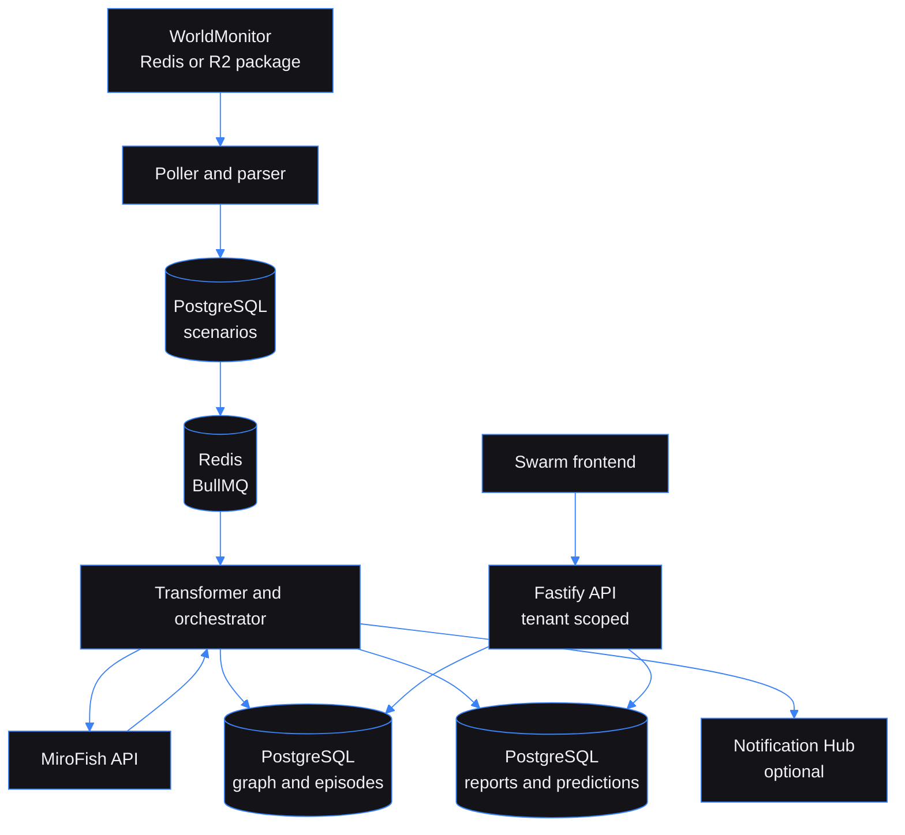
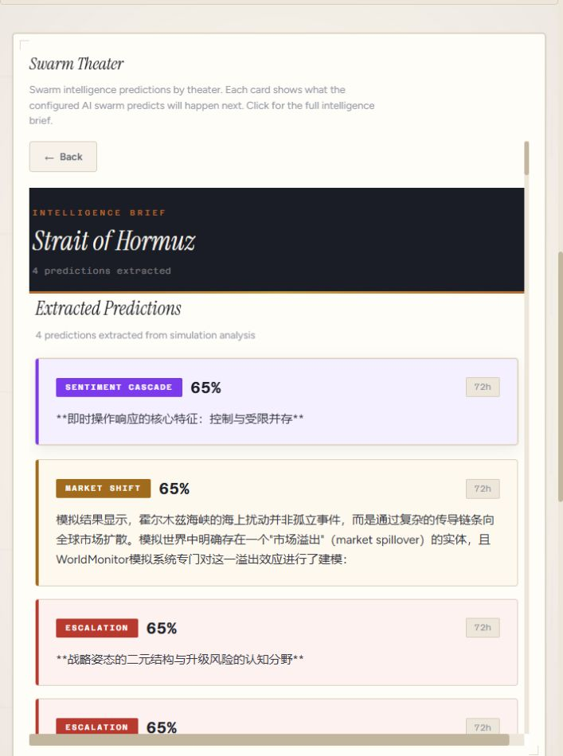

# Swarm Intelligence Gateway: Turns live event packages into inspectable swarm simulations

Built by [Kingsley Onoh](https://kingsleyonoh.com) · Systems Architect

## The Problem

WorldMonitor shows what is happening. MiroFish explores what might happen next. Without a bridge, an operator has to reshape each event package into simulation input, wait through an upstream multi-step run, and then make sense of a report that was not designed as an API response.

Swarm Intelligence Gateway turns that handoff into a tenant-scoped batch pipeline. In the latest local run, a real WorldMonitor package completed a MiroFish simulation in just under eight minutes and produced a persisted report plus four structured predictions.

## Architecture



The poller reads WorldMonitor's `forecast:simulation-package:latest` key, accepts both direct JSON and the current R2 pointer shape, and writes a validated scenario. BullMQ holds the long-running work. The orchestrator generates the seed document, asks MiroFish to build its graph, starts the simulation, fetches the report, and persists the result.

PostgreSQL is the gateway's system of record for tenants, scenarios, graph nodes, edges, agent episodes, profiles, reports, and predictions. Its pgvector columns support local semantic episode search. This replaces Zep for gateway-owned storage and retrieval. The upstream MiroFish checkout remains an opaque service and still uses its own configured graph provider during graph construction.

## Key Decisions

- I chose PostgreSQL with pgvector over Zep for gateway-owned memory because the gateway needs tenant-scoped persistence and local semantic search without an external memory bill.
- I chose a BullMQ worker with concurrency one over parallel simulation workers because MiroFish runs are memory-heavy and a single active run is predictable on a small host.
- I chose hourly polling and REST status checks over a streaming protocol because WorldMonitor packages arrive in batches and MiroFish runs take minutes.
- I chose the WorldMonitor vanilla TypeScript panel system over a new frontend framework because the swarm UI can share its globe, polling, and panel conventions with the source project.

## Setup

### Prerequisites

- Node.js 22 or newer
- Docker Engine or Docker Desktop with Compose
- PostgreSQL 16 with pgvector, supplied by the development Compose file
- Redis 7, supplied by the development Compose file
- A running MiroFish backend for real simulations
- A WorldMonitor instance or a Redis/R2 source containing simulation packages

### Installation

```bash
git clone https://github.com/kingsleyonoh/swarm-intelligence-gateway.git
cd swarm-intelligence-gateway
npm install
cp .env.example .env.local
```

Fill in `.env.local` before starting the gateway. Do not commit it.

### Environment

| Variable | Purpose |
|---|---|
| `DATABASE_URL` | PostgreSQL connection string. Required. |
| `REDIS_URL` | Gateway Redis connection for BullMQ and cache. Required. |
| `WORLDMONITOR_REDIS_URL` | WorldMonitor Redis connection for the simulation package and intelligence reader. |
| `WORLDMONITOR_REDIS_TOKEN` | Optional WorldMonitor deployment credential retained for upstream Redis configuration. |
| `WORLDMONITOR_R2_ACCOUNT_ID` | Cloudflare account ID when WorldMonitor publishes an R2 pointer. |
| `WORLDMONITOR_R2_BUCKET` | R2 bucket containing the referenced package. |
| `WORLDMONITOR_R2_API_TOKEN` | R2 API token for pointer resolution. |
| `WORLDMONITOR_R2_API_BASE_URL` | Optional Cloudflare API base URL. Defaults to the public v4 API. |
| `MIROFISH_API_URL` | MiroFish HTTP API base URL, such as `http://127.0.0.1:5001`. |
| `DEEPSEEK_API_KEY` | LLM credential used by the MiroFish setup. Keep it out of source control. |
| `PORT` | Gateway port. Defaults to `3000`. |
| `NODE_ENV` | `development`, `test`, or `production`. |
| `LOG_LEVEL` | Pino log level. Defaults to `info`. |
| `POLL_INTERVAL_MINUTES` | WorldMonitor poll interval. Defaults to `60`. |
| `DEFAULT_AGENT_COUNT` | Agent count when a simulation does not provide one. Defaults to `4096`. |
| `DEFAULT_ROUND_COUNT` | Round count when a simulation does not provide one. Defaults to `5`. |
| `SELF_REGISTRATION_ENABLED` | Enables `POST /api/tenants/register`. Defaults to `true`. Disable after onboarding. |
| `DATA_RETENTION_DAYS` | Age threshold for the daily simulation cleanup job. Defaults to `90`. |
| `NOTIFICATION_HUB_ENABLED` | Enables ecosystem event delivery. Defaults to `false`. |
| `NOTIFICATION_HUB_URL` | Notification Hub base URL when the feature is enabled. |
| `NOTIFICATION_HUB_API_KEY` | Notification Hub API key when the feature is enabled. |
| `WEBHOOK_SECRET` | Optional secret required on scenario ingest requests. |
| `SENTRY_DSN` | Optional Sentry DSN for error telemetry. |
| `DEMO_MODE` | Enables demo security protections. Defaults to `false`. |
| `GROQ_API_KEY` | Optional WorldMonitor forecast-seeder credential. It is not required by the gateway itself. |

For the live frontend, create `packages/frontend/.env.local` with the API key printed by `npm run setup`:

```bash
VITE_API_KEY=sig_your_tenant_key
VITE_DEMO_MODE=false
```

If `VITE_API_KEY` is missing, the frontend loads its checked-in demo data instead of calling the gateway.

### Run

Start the gateway dependencies, migrate the database, create the first tenant, and start both applications:

```bash
docker compose up -d postgres redis
npm run db:migrate
npm run setup
npm run dev
```

In a second terminal:

```bash
npm --workspace packages/frontend run dev
```

The API runs on `http://localhost:3000`. The frontend runs on `http://localhost:5173` and proxies `/api` requests to the gateway. `npm run db:migrate` needs `DATABASE_URL` in the shell environment because the migration command does not load `.env.local` itself.

## Usage

All protected routes use `X-API-Key`. The gateway scopes scenario, simulation, profile, episode, graph, and prediction queries to the authenticated tenant.

### Create a tenant

```bash
curl -X POST http://localhost:3000/api/tenants/register \
  -H 'Content-Type: application/json' \
  -d '{"name":"Local Operator"}'
```

The API returns the plaintext key once:

```json
{"id":"<tenant-id>","name":"Local Operator","apiKey":"sig_<save-this-key>"}
```

### Choose a scenario

```bash
curl http://localhost:3000/api/scenarios/templates
```

The response is `{ "templates": [{ "id": "persian-gulf", "label": "...", "category": "market" }] }`. Templates provide a quick local path; the normal poller reads the latest WorldMonitor package and ingests it as a scenario.

### Launch a simulation

```bash
curl -X POST http://localhost:3000/api/simulations/launch \
  -H "X-API-Key: $API_KEY" \
  -H 'Content-Type: application/json' \
  -d '{"templateId":"persian-gulf"}'
```

The response contains the created scenario and queued simulation:

```json
{"scenarioId":"<scenario-id>","simulationId":"<simulation-id>","status":"pending","template":{"label":"...","category":"market"}}
```

### Check progress

```bash
curl http://localhost:3000/api/simulations/<simulation-id> \
  -H "X-API-Key: $API_KEY"
```

The detail response includes `status`, `agentCount`, `roundCount`, upstream MiroFish IDs, timestamps, and any `errorMessage`. The status moves through `pending`, `queued`, `graph_building`, `simulating`, and `reporting` before `completed`, `failed`, or `cancelled`.

### Read the report and predictions

```bash
curl http://localhost:3000/api/simulations/<simulation-id>/report \
  -H "X-API-Key: $API_KEY"
```

The completed response is `{ "report": "<markdown>", "predictions": [{ "theater": "...", "predictionType": "market_shift", "summary": "...", "confidence": "0.6500", "timeHorizon": "72h", "supportingFactions": [], "dissentingFactions": [] }] }`.

The same predictions are queryable through `GET /api/predictions` and `GET /api/predictions/latest`, both with cursor pagination and tenant filtering. `GET /health`, `GET /health/db`, and `GET /health/ready` are public operational checks.

### Local evidence

The following capture comes from the live gateway UI after the latest locally available WorldMonitor package ran through the real MiroFish service. It is not demo fixture data.



The package was `forecast:simulation-package:latest`, run `live-worker-1787926262176`, generated at `2026-08-28T12:17:37.196Z`. The completed local run persisted 12 graph nodes, 12 graph edges, 37 agent episodes, 2 profiles, an 8,366-character report, and 4 predictions. Provider-generated natural-language output may be mixed-language; the frontend preserves the upstream content instead of discarding it.

## Tests

```bash
npm test
npm run test:e2e
npx tsc --noEmit
npm run build
npm --workspace packages/frontend test
npm --workspace packages/frontend run build
docker build -t swarm-gateway:verification .
```

The verified local run covered the real PostgreSQL, pgvector, Redis, WorldMonitor, and MiroFish path with one active simulation worker. The full backend suite passed 518 tests, the frontend suite passed 378 tests, and the production container build passed.

## Deployment

The repository includes a production Compose file for a future self-hosted deployment. This checkout has not been deployed and does not claim a public URL or a published container image. Its Traefik label currently names `swarm.kingsleyonoh.com`; that is a deployment target, not live-service evidence.

### Production Stack

| Component | Role |
|---|---|
| `swarm-gateway` | Node.js 22 gateway container on port `3000`. |
| `postgres` | PostgreSQL 16 with pgvector and a persistent volume. |
| `redis` | Redis 7 queue and cache with a persistent volume. |

### Self-host

Set the production variables in `.env`, including `POSTGRES_PASSWORD`, then validate and start the stack:

```bash
docker compose -f docker-compose.prod.yml config
docker compose -f docker-compose.prod.yml up -d
```

Configure DNS, TLS, the upstream MiroFish and WorldMonitor services, and any image registry separately. None of those external actions are performed by this repository workflow.

<!-- THEATRE_LINK -->
