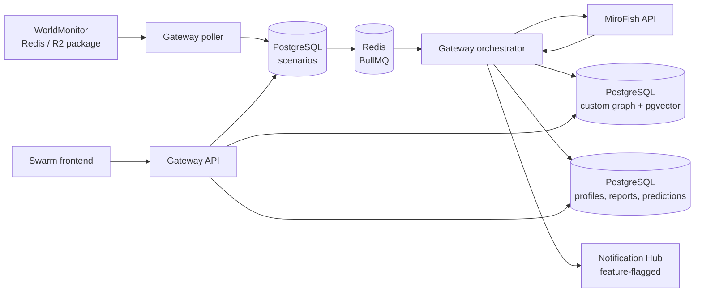

# Swarm Intelligence Gateway architecture

The gateway is the tenant-scoped bridge between WorldMonitor's current
simulation package and the upstream MiroFish simulation API.

## Ownership boundary

PostgreSQL is the gateway's system of record for tenant data, mirrored
MiroFish graph nodes and edges, agent episodes, profiles, reports, and parsed
predictions. Embeddings are generated locally and stored in pgvector; episode
search does not call an external memory service.

The official MiroFish checkout is treated as an opaque upstream service. Its
current public API still constructs its own upstream graph through the graph
provider configured by that checkout. This repository does not fork or modify
MiroFish. The gateway therefore replaces external memory for gateway-owned
storage and retrieval while preserving the upstream provider boundary required
by the current MiroFish API.

## Runtime contracts

- Protected API requests carry `X-API-Key`; every database query includes the
  authenticated tenant scope.
- WorldMonitor input supports both a direct package and the current pointer
  shape (`runId` plus `pkgKey`), with R2 retrieval for pointer deployments.
- MiroFish runs through its actual create, prepare, start, report-generation,
  and report-fetch lifecycle. The worker is deliberately concurrency one.
- Notification Hub delivery is best effort and feature-flagged. A delivery
  failure is recorded without changing a completed simulation to failed.
